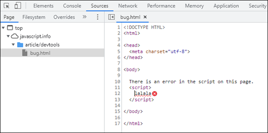

# JavaScript Introduction
**Reference**
- https://javascript.info/intro

JavaScript was initially created to "make web pages alive". JavaScript initially had another name called "LiveScript", but Java was very popular at the time, so it was decided that positioning a new language as a "younger brother" would help.

JavaScript was initially created as a browser-only language, but it is now used in many other environments as well.

JavaScript can execute in the browser and on the server, or on any device that has the [JavaScript Engine](https://en.wikipedia.org/wiki/JavaScript_engine). The browser has an embedded engine called a "JavaScript virtual machine". Different engines have different code names:
- Chrome and Edge use the [V8](https://en.wikipedia.org/wiki/V8_(JavaScript_engine)) JavaScript engine
- Firefox started with the [SpiderMonkey](https://en.wikipedia.org/wiki/SpiderMonkey) JavaScript engine 
- Safari has a bunch of different code names for its JavaScript engines

In-browser JavaScript is considered safe and does not provide low-level access to memory or CPU. However, JavaScripts capabilities vary depending on the environment it's running in. For example, Node.js supports functions that allow JavaScript to read/write files. In-browser JavaScript cannot do the following:
- Read/write arbitrary files on the disk, copy them, or execute programs
- JavaScript from one page may not access content from the other page unless both pages agree. This is called **Same Origin Policy**
- JavaScript has limited ability to communicate with other sites unless explicit agreement is given from the remote side

Here are tree great things about JavaScript:
1. Full integration w/ HTML/CSS
2. Simple things are done simply
3. Supported by all major browsers and enabled by default

JavaScript is the only technology that combines these three things!

There are a few spinoff languages from JavaScript. These languages are *transpiled* (converted) to JavaScript before they run in the browser:
- [TypeScript](https://www.typescriptlang.org/) - developed by Microsoft and concentrates on "strict data typing"
- [CoffeeScript](http://coffeescript.org/) - "syntactic sugar" for JavaScript.  Ruby devs like it.
- [Flow](https://flow.org/) - adds data typing, similar to TypeScript. Used by Facebook.
- [Brython](https://brython.info/) - a Python 3 implementation of JavaScript
- [Kotlin](https://kotlinlang.org/docs/getting-started.html) - a modern, concise, and safe programming language that can target the browser or Node

The resource recommends to look at each of the languages above after mastering JavaScript.

## Manuals and Specifications
**Reference:**
- https://javascript.info/manuals-specifications

The [ECMA-262 specification](https://www.ecma-international.org/publications-and-standards/standards/ecma-262/) defines the language, but it's not for every day use. The [MDN Mozilla JavaScript Reference](https://developer.mozilla.org/en-US/docs/Web/JavaScript/Reference) is the main manual with examples and other information. Use this for every day reference.

The following two resources are also helpful allow for understanding support among browser-based and other engines:
- http://caniuse.com - per-feature tables of support
- https://kangax.github.io/compat-table/es6/ - a table with language features and engines that support those or don't support

## Developer Console
**Reference**
- https://javascript.info/devtools

Use the developer tools (F12) in a browser to view JavaScript errors. The page [bug.html](https://javascript.info/article/devtools/bug.html) has an error in the JavaScript code.

Use the **Console** tab to view the error.

Then click the link to the view the source of the error.

