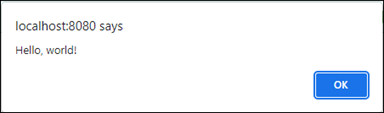

# JavaScript Fundamentals
**Reference:**
- https://javascript.info/first-steps

**Topics**
- [Hello, World!](#hello-world)
- [Code Structure and Comments](#code-structure)
- [Abut Strict Mode](#about-strict-mode)

## Hello, World!
<details>

**Reference**
- https://javascript.info/hello-world

The simplest way to create a Hello World script is to use the `<script>` tag:

```HTML,JavaScript
<!DOCTYPE html>
<html>
  <body>
    <p>Before the script...</p>
    
    <script>
      alert( 'Hello, world!');
    </script>

    <p>...After the script.</p>
  </body>
</html>
```

This prints out the following message:

&emsp;

Alternatively, you can place the code `alert ('Hello, world!")` in a separate file and reference it:

```HTML
<!DOCTYPE html>
<html>
  <body>
    <p>Before the script...</p>
    
    <script src="assets/script.js"></script>

    <p>...After the script.</p>
  </body>
</html>
```
</details>

## Code Structure
<details>

**Reference**
- https://javascript.info/structure

### Statements
Statements are typically written on separate lines to make the code more readable. Semicolons may be omitted in most cases where a line break exists:

```JavaScript
alert('Hello')
alert('World')
```
In most cases a newline implies a semicolon, but there are cases where a newline doesn't mean a semicolon:
```JavaScript
alert(3 +
1
+ 2);
```
In the code above, JavaScript understands the "+" indicates an incomplete expression, and does not apply a semicolon. However, there are situations where JavaScript fails to assume a semicolon where it is really needed, so the **authors recommend putting semicolons between statements even if they are separated by newlines**.

### Comments
**Reference**
- https://developer.mozilla.org/en-US/docs/Web/JavaScript/Guide/Grammar_and_Types#comments

One-line comments start with two forward slash characters `//`:
```JavaScript
// This comment occupies a line of its own
alert (Hello);
```

Multiline comments start w/ a forward slash and an asterisk `/*` and end with an asterisk and a forward slash `*/`:
```JavaScript
/* An example with two messages.
This is a multiline comment.
*/
alert('Hello');
```
</details>

## About Strict Mode
<details>

**Reference**
- https://javascript.info/strict-mode
- https://developer.mozilla.org/en-US/docs/Web/JavaScript/Reference/Strict_mode

You may see scripts that start with the directive `use strict`. This directive enables new modifications to JavaScript introduced by the [ECMAScript 5 (ES5)](https://262.ecma-international.org/5.1/) language specification.

When you add `"use strict"` to a script, you're telling the script to behave the "modern" way. You can add this directive at the beginning of the script or at the beginning of a function. Once you add it, there's no way to cancel or deactivate it -- once you enter strict mode, there's no going back.
</details>
